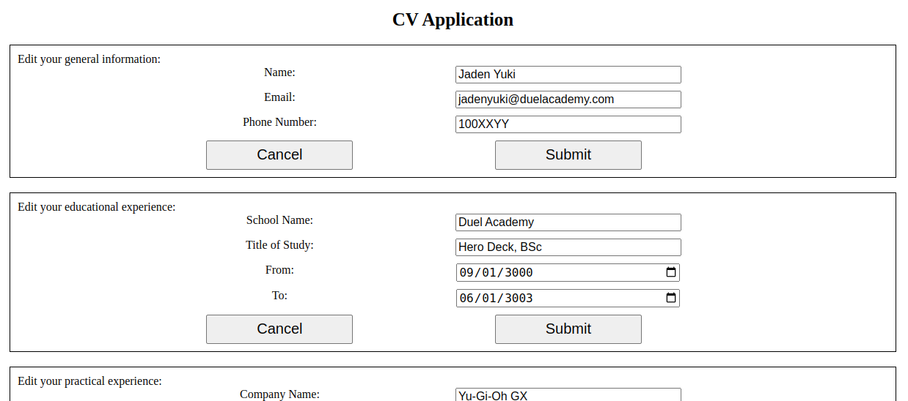

# 19.odin_cv_application

[Task Description](https://www.theodinproject.com/lessons/node-path-javascript-cv-application)

[Live Preview](https://maxim55069633.github.io/19.odin_cv_application/)

It's my first react project. I make heavy use of state and props.

I learn:

1. `setState` is an async function. [How to deal with this problem](https://www.geeksforgeeks.org/is-setstate-method-async/)
2. Use array and object destructuring
3. [Deploy React app in Github page](https://medium.com/@isharamalaviarachchi/how-to-deploy-your-react-app-into-github-pages-b2c96292b18e)

Sample:

1. 
